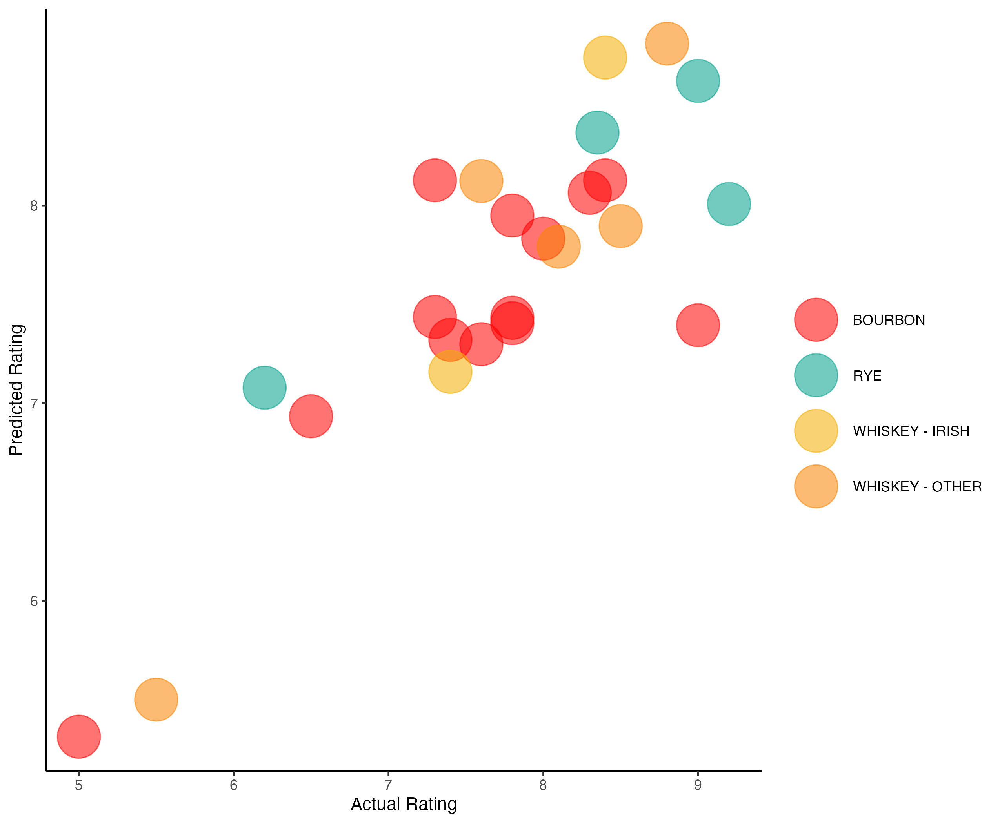

# Modeling Whiskey Ratings

This is a Machine Learning pipeline that predicts the overall rating of a whiskey based on its flavor profile, proof, and style.

## Pipeline Details
* I've filled out a Google Sheet with the metadata and reviews of 24 different whiskeys from around the world
* This raw data is represented in BigQuery as a Connected Sheet - this serves as the input data in our `dbt` project
* The transformations *and* the applied Machine Learning all occur seamlessly in the same `dbt` pipeline
  * The `staging` layer reshapes the data to prepare it for modeling
  * The `production` layer fits and applies the regression model

## Setup
You can run all of the necessary `dbt` commands directly from the Docker container - just run `make shell` to initialize the container and execute `dbt build` directly from the command line.

The only requisitie cloud infrastructure required is a Google Storage bucket - this can be modified in [the dbt profile YAML](./src/profiles.yml), and is only required to unload the PySpark batches as they run on GKE clusters.